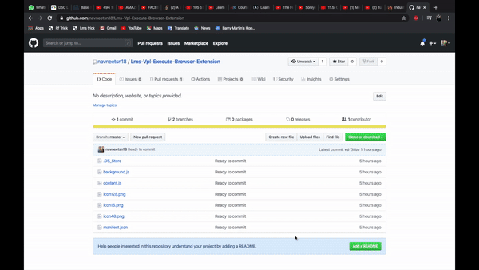

# Lms Vpl Execute Browser Extension

So, why to waste time when LMS is showing out of memory and not move to the next VPL.
Here is the solution just install the extension and keep that load on us.
Just on the developer mode on extension and install the extension.

### Please note that after installing the  extension don't delete the folder otherwise the extension will not work. So kindly install the extension from a safe folder location.

